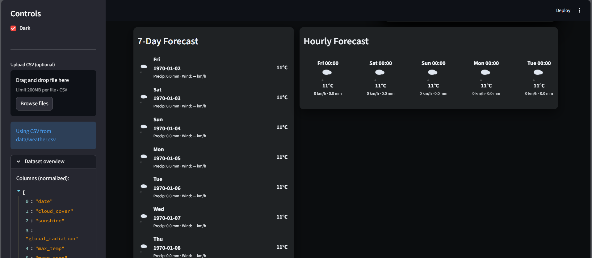
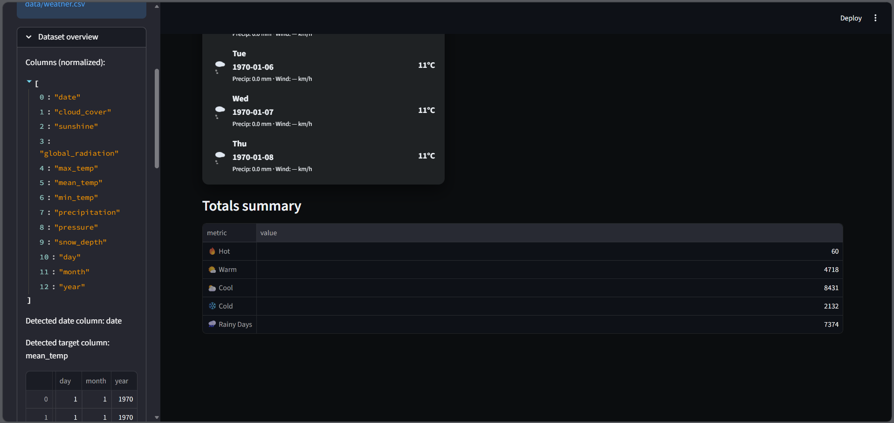
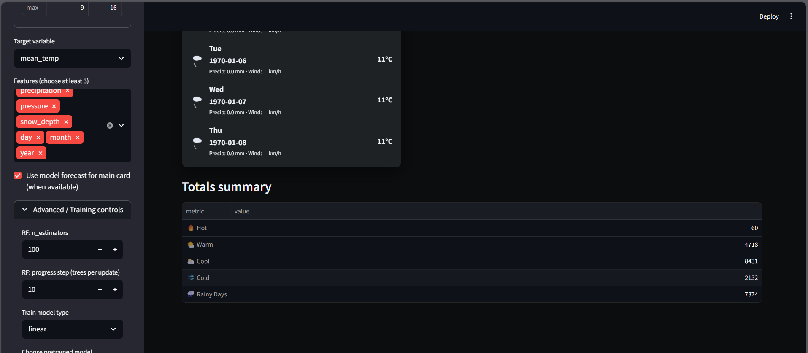
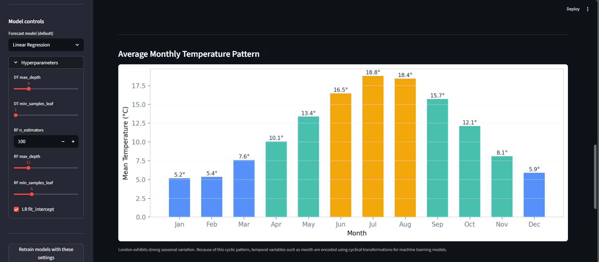

# 🌤️ Synoptic Weather Forecast Dashboard

A **machine learning powered weather analysis and forecasting dashboard** built with **Python, Streamlit, and Scikit-learn**.  
This focused submission demonstrates a clear ML pipeline: preprocessing, EDA, model comparison, evaluation, and a short forecasting interface.


---










## 🚀 Features

### 📊 Interactive Data Analysis
* Time series visualization of the chosen target variable (e.g., `mean_temp`).
* Monthly aggregation and monthly boxplots for seasonality inspection.
* Correlation heatmap and distribution plots for exploratory analysis.
* Summary statistics and missing-value reporting.

### ☁️ Weather Overview (derived from dataset)
* Simple classification of weather conditions for presentation purposes.
* Totals summary (counts of cold/warm/hot/rainy days) derived from the dataset.
* Animated emoji indicators for forecast presentation:
  * Big sunny emoji: `☀️` (used when predicted temperature is >= threshold)
  * Big rainy emoji: `🌧️` (used when predicted temperature is below threshold)
  * (Emoji animations are implemented in the dashboard front end.)

### 🤖 Machine Learning Models
This project compares **three** models (kept simple and academic):

* **Linear Regression** — baseline with scaling
* **Decision Tree Regressor** — interpretable non-linear baseline
* **Random Forest Regressor** — stronger ensemble model

Evaluation metrics shown:

* **MAE** (Mean Absolute Error)
* **RMSE** (Root Mean Squared Error)
* **MAPE** (Mean Absolute Percentage Error)
* **R²**

### 🔮 Forecasting
* Use the best-performing model (by RMSE) from the evaluation to generate a short horizon forecast.
* Iterative forecast logic: uses the last row’s features and injects predicted values for multi-day horizons.
* Downloadable CSV of forecast results.
* Optional: present forecasts using large animated emoji (sun/rain) in the forecast table.

---

## 📄 Pages in this App

- **Home**
  - Project title and description
  - Dataset summary
  - Two time-series visualizations
  - Monthly boxplot to visualize seasonality

- **EDA**
  - Numerical summary of dataset
  - Missing-values table
  - Correlation heatmap
  - Target variable distribution plot

- **Models & Evaluation**
  - Chronological train/test split
  - Model training and comparison
  - Metrics table (MAE, RMSE, MAPE, R²)
  - Predicted vs actual plot
  - Random Forest feature importance visualization

- **Forecast**
  - Generate an **N-day forecast**
  - Uses the best-performing model
  - Download forecast results as CSV
  - Optional large emoji forecast indicators

---

## 📂 Project Structure

```
synoptic-weather-forecast/
├── dashboard.py                # Main Streamlit dashboard
├── requirements.txt            # Python dependencies
├── README.md                   # Project documentation
├── data/
│   └── weather.csv             # Dataset (place here)
├── models/                     # Saved trained models (ignored by git)
└── src/
    ├── analysis.py             # Data analysis & visualization helpers
    ├── data_loader.py          # Loading and preprocessing
    ├── models.py               # Model save/load helpers
    └── train.py                # Training & evaluation functions
```

---

## ⚙️ Installation

### 1️⃣ Clone the repository

```bash
git clone https://github.com/M7md-Faraj/synoptic-weather-forecast.git
cd synoptic-weather-forecast
```

### 2️⃣ Create and activate a virtual environment  
*(Do NOT include this in the submission)*

```bash
python -m venv venv
```

#### Linux / Mac

```bash
source venv/bin/activate
```

#### Windows (PowerShell)

```bash
.\venv\Scripts\Activate.ps1
```

### 3️⃣ Install dependencies

```bash
pip install -r requirements.txt
```

---

## ▶️ Running the App

Start the Streamlit dashboard:

```bash
streamlit run dashboard.py
```

Then open the following address in your browser:

```
http://localhost:8501
```

---

## 📊 Dataset

Place your cleaned CSV file in:

```
data/weather.csv
```

### Required / Recommended Columns

| Column | Description |
|------|------|
| `date` | Date column (ISO or YYYYMMDD format) — **required** |
| `mean_temp` | Mean temperature (recommended prediction target) |

### Optional but Useful Columns

- `max_temp`
- `min_temp`
- `precipitation`
- `sunshine`
- `cloud_cover`
- `global_radiation`
- `pressure`

The app will:

* Automatically detect the **date column**
* Convert numeric-like columns
* Attempt **missing value handling**

See `src/data_loader.py` for full preprocessing logic.

---

## 🧠 Machine Learning Workflow

### 1️⃣ Data Preprocessing
* Normalize column names
* Parse date columns
* Convert numeric-like values
* Handle missing values (forward/back fill)

### 2️⃣ Train/Test Split
* Chronological split (time-aware)
* Prevents **data leakage**

### 3️⃣ Model Training
Three models are trained:

* Linear Regression
* Decision Tree Regressor
* Random Forest Regressor

### 4️⃣ Model Evaluation
Metrics computed:

* **MAE**
* **RMSE**
* **MAPE**
* **R²**

The **best model is selected using RMSE**.

### 5️⃣ Forecasting
Forecasting is done using:

* **Iterative prediction**
* Based on the **latest row of data**
* Predicted values feed the next step

---

## 🎨 UI Notes & Design Choices

* The UI is intentionally **minimal and academic**
* Focus remains on **data science workflow**
* Visualization clarity is prioritized over styling

Additional design notes:

* Animated emoji used **only on the forecast page**
* No CSV upload to ensure **dataset reproducibility**
* Layout designed for **Streamlit simplicity**

---

## 🔮 Future Improvements

Potential enhancements:

* Cross-validation or **rolling window backtesting**
* **Hyperparameter tuning** (GridSearch / RandomSearch)
* Integration with **external weather datasets**
* Advanced time-series models:
  - **LSTM**
  - **Temporal Convolutional Networks**
* Probabilistic forecasting
* Automatic feature engineering

---

## 👨‍💻 Author

**Mohammed Faraj**

GitHub  
https://github.com/M7md-Faraj

---

## 📜 License

MIT License