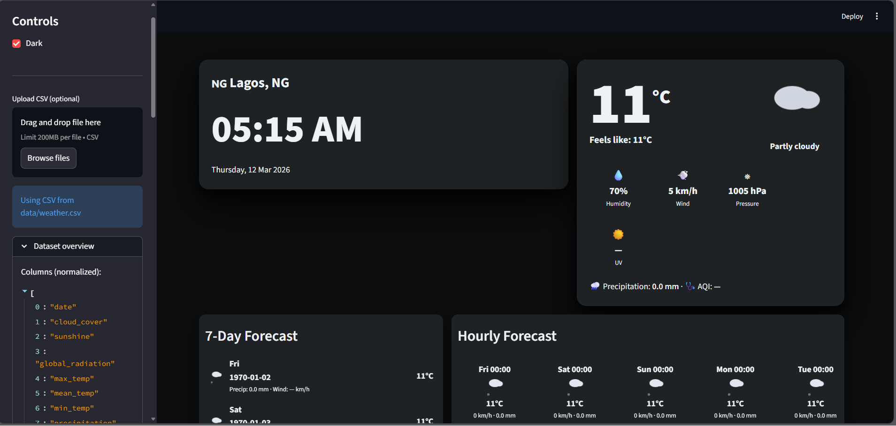

# 🌤️ Synoptic Weather Forecast Dashboard

A **machine learning powered weather analysis and forecasting dashboard** built with **Python, Streamlit, and Scikit-learn**.
The application allows users to explore weather datasets, visualize trends, train predictive models, and generate forecasts interactively.




---

## 🚀 Features

### 📊 Interactive Data Analysis

* Time series visualization of weather variables
* Correlation heatmap between features
* Distribution analysis of weather measurements
* Summary statistics of dataset variables

### ☁️ Weather Overview

* Automatic classification of weather conditions
* Total counts for:

  * Rainy days
  * Sunny days
  * Hot days
  * Cold days
* Animated weather emoji indicators 🌧️ ☀️ ❄️

### 🤖 Machine Learning Models

The dashboard allows training and evaluation of:

* **Random Forest Regressor**
* **SGD Regressor**

Features include:

* Live training progress
* Model performance tracking
* Automatic model saving
* Pretrained model loading

### 🔮 Forecasting

Users can:

* Predict future weather values
* Run quick naive forecasts
* Download prediction results as CSV

---

## 🖥️ Dashboard Interface

The dashboard includes:

* Weather totals overview
* Interactive time series charts
* Correlation heatmaps
* Feature importance visualization
* Model training controls
* Prediction tools

Built with a **modern UI using Streamlit**.

---

## 🏗️ Project Structure

```
synoptic-weather-forecast
│
├── dashboard.py          # Main Streamlit dashboard
├── requirements.txt      # Python dependencies
├── README.md             # Project documentation
│
├── data/                 # Weather dataset
│   └── weather.csv
│
├── models/               # Saved trained models
│
└── src/
    ├── analysis.py       # Data analysis & visualization functions
    ├── data_loader.py    # Dataset loading and preprocessing
    ├── models.py         # Model saving/loading utilities
    └── train.py          # Model training functions
```

---

## ⚙️ Installation

### 1️⃣ Clone the repository

```bash
git clone https://github.com/M7md-Faraj/synoptic-weather-forecast.git
cd synoptic-weather-forecast
```

### 2️⃣ Create a virtual environment

```bash
python -m venv venv
```

Activate it:

**Linux / Mac**

```bash
source venv/bin/activate
```

**Windows**

```bash
venv\Scripts\activate
```

---

### 3️⃣ Install dependencies

```bash
pip install -r requirements.txt
```

---

## ▶️ Running the Application

Launch the Streamlit dashboard:

```bash
streamlit run dashboard.py
```

The application will open in your browser:

```
http://localhost:8501
```

---

## 📦 Dependencies

Main libraries used:

* **Streamlit** – Interactive dashboard
* **Pandas** – Data processing
* **NumPy** – Numerical computations
* **Scikit-learn** – Machine learning models
* **Plotly** – Interactive visualizations
* **Joblib** – Model serialization

---

## 📊 Dataset

The project uses a **synoptic weather dataset** containing variables such as:

* Mean temperature
* Maximum temperature
* Minimum temperature
* Precipitation
* Sunshine hours

These variables are used for **analysis and predictive modeling**.

---

## 🧠 Machine Learning Workflow

1. Load weather dataset
2. Preprocess features
3. Select training features
4. Train regression models
5. Evaluate performance
6. Save trained models
7. Generate predictions

---

## 📈 Example Capabilities

✔ Detect weather trends
✔ Predict temperature or precipitation
✔ Analyze weather distributions
✔ Train ML models interactively
✔ Export prediction results

---

## 🛠️ Future Improvements

Possible enhancements include:

* Deep learning models
* Real-time weather API integration
* Deployment to cloud platforms
* Automated hyperparameter tuning
* Improved forecasting algorithms

---

## 👤 Author

**Mohammed Faraj**

GitHub:
https://github.com/M7md-Faraj

---

## 📜 License

This project is open source and available under the **MIT License**.
